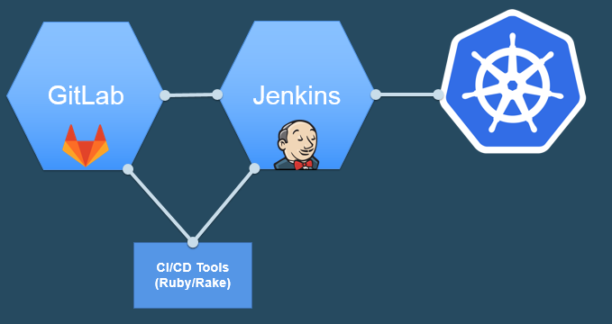

# CI/CD Pipeline Buildup on Airgap environment in ICp

This repo demonstrate the automatic build of CI/CD pipeline flow in a airgap environment (No connection to internet) with the help of IBM Could Private (ICp)

## Architecture
Given the restriction of airgap, the github based CI/CD flow will not work. 

Instead we deploy GitLab and Jenkins to ICp, and we developed a set of rake task library to facilitate the automatic pipeline building.




## Deploy GitLab and Jenkins to ICp

As a prerequisite, you need to have dynamic storage provisioning set up in ICp and a default storage class is defined.

Assume you have helm client installed, deploy the GitLab and Jenkins with the following command. 

```
helm install --set "serviceType=NodePort,externalUrl=http://icp-master/,gitlabRootPassword=password" stable/gitlab-ce

helm install --set "Master.ServiceType=NodePort,Master.AdminPassword=password,Master.InstallPlugins=kubernetes:0.11,workflow-aggregator:2.5,workflow-job:2.13,credentials-binding:1.12,git:3.4.0,gitlab:1.4.7" stable/jenkins
```

Wait for the helm chart deployed, PVC bounded, GitLab and Jenkins PODs running.

### Initial setup of GitLab and Jenkins

#### GitLab
1. Found out the service NodePort exposed for GitLab
2. Launch the GitLab URL, http://master_ip:3xxxxx
3. Register yourself with the GitLab UI
4. Goto the user profile, copy the api token

#### Jenkins
1. Found out the service NodePort exposed for Jenkins
2. Launch the Jenkins URL, http://master_ip:3xxxxx
3. Login with admin/password
4. Update the configuration to allow user self registration
5. Register your self in Jenkins
6. Create a credential to access GitLab with your GitLab id and password
7. Copy your id's API token for later usage.

## A sample pipeline build up

It is assumed that you will work from your laptop and access the ICp that is remote or in VM environment.

You will need to have ruby installed and the following gem installed

```
gem install citasks
```

- Clone the git repo
- Update the .env file. A sample is shown as below,
```
GITLAB_USER = wenzm

#URL to access out side of k8s cluster
GITLAB_BASE_URL = http://192.168.aaa.xxx:3xxxx
GITLAB_IN_CLUSTER_BASE_URL = http://pondering-boxer-gitlab-ce
GITLAB_API_TOKEN = Rj_gspgRjpNzsWGxnSQ_

JENKINS_URL = http://192.168.aaa.xxx:3xxxx
JENKINS_IN_CLUSTER_URL = http://opining-zorse-jenkins:8080
JENKINS_GIT_USER_CREDENTIAL_ID = gitlab-wenzm-password

JENKINS_USER = wenzm
JENKINS_USER_API_TOKEN = 4d5e1fad1e5efa08b31b928ca618b285

JENKIN_PROJECT_ENDPOINT_AUTHENTICATION = false

JOB_NAME=cicd-demo
REPO_NAME=cicd-demo

COMPILER_DOCKER_IMAGE=golang:1.8.3

#for private docker registry
ICP_MASTER_IP=192.168.aaa.xxx
```

Noted there are two URLs for GitLab and Jenkins each. One is for accessing from outside of the K8s cluster, the other one is from the inside of the cluster. You can use the name that defined in the services.

Give a JOB_NAME for Jenkins' project and a REPO_NAME for GitLab repo.

Here we are using a simple golang to demonstrate the pipeline, so the compiler image is set as golang. (You can examine the golang source code in the src/ directory)

- With the 3 lines rakefile, the pipeline can be built automatically

  ```
  require 'dotenv'
  Dotenv.load

  require 'citasks'

  ```

- List the tasks inside the rakefile
  ```
  rake -T
  rake Gitlab:01_create_new_repo      # create a new gitlab repo of icp-demo-app
  rake Gitlab:02_webhook              # setup webhook
  rake Gitlab:03_delete               # delete icp-demo-app
  rake Jenkins:01_create_new_project  # create a new project icp-demo-app
  rake Jenkins:02_delete              # delete icp-demo-app
  rake git:01_commit[msg]             # add and commit
  rake git:02_set_remote_orgin        # set remote origin to http://localhost...
  rake git:03_set_remote_url          # reset remote url http://localhost:312...
  rake git:04_push                    # push
  ```

- Run the task one by one in order.
  1. Gitlab:01_create_new_repo
        
      Validate the repo with the defined REPO_NAME created in GitLab
  2. Gitlab:02_webhook
      
      Validate the integrations is created in this repo.

  3. Jenkins:01_create_new_project

      Validate the project created in Jenkins

- The Jekins:01_create_new_project task will create a set of scaffold files for the pipeline build up. 

  Validate the Jenkinsfile created.

  Update the Jenkinsfile, for example with the following content
  ```
      container('compiler'){
       stage('Test'){
         sh("echo testing")
         sh("go test src/*.go")
       }

       stage('Compile and Build'){
         sh("echo compile")
         sh("go build -o myhandler src/*.go")
       }
      }

      container('citools'){
        stage('Docker Build'){
          sh "echo build docker image"
          sh "rake -f build.rb docker:01_build_image docker:02_push_to_ICp_registry"  
        }

        stage('Deploy into k8s'){
          sh "echo rollout to k8s" 
          sh "rake -f build.rb k8s:01_deploy_to_k8s"
        }
      }
  ```
- Update the Dockerfile created with the task

  Putting the actual exe file created in the Jenkinsfile compile stage,

  ```
  FROM bitnami/minideb
  ADD myhandler /
  ENV LISTENING_PORT 80

  CMD ["/myhandler"]

  ```

- Now you can push the repo to GitLab
```
git init
rake git:01_commit["initial release"]
rake git:02_set_remote_orgin
rake git:04_push
```

- Upon the push, monitor Jenkins pipeline kicks off

- When the pipeline build finishes, validate the deployments in K8s. 

- Find out the service port for the deployment. Launch the URL to validate the application is giving the host ENV information.


